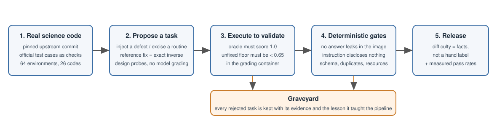

<div align="center">

# ScienceIDE

**An environment where AI agents do real scientific-computing work: read a real simulation codebase, change it, and get graded on whether the science still comes out right.**

   

</div>

Every task is a containerized episode on a **pinned, unmodified upstream scientific code**. The agent edits source; a verifier recompiles the code, re-runs its own physics cases and compares the numbers against reference output. Reward comes from the simulation being **numerically right again**, not from matching a diff.

<p align="center"></p>

## What is in this repository

| Directory | Contents |
|---|---|
| [`environments/`](environments/) | 15 of the 64 environments with their full runtime (container templates, physics cases, checks, scoring) and upstream licenses; the other 49 are named and held out as a test set |
| [`hard85/`](hard85/) | 30 of the 85 ScienceIDE-Hard tasks (instruction, injected defect, reference fix, provenance, measurement records); the other 55 are named and held out |
| [`RL/`](RL/) | Reinforcement learning on these tasks (async GRPO on PSRL): recipe, curves and results |

This is a preview of work in progress. The full environment set, the complete task bank and the task-authoring pipeline are maintained in **[Gen-Verse/ScienceInfra](https://github.com/Gen-Verse/ScienceInfra)** and will be released as the work matures.

## How tasks work

- **Repair**: a semantic defect is injected into the pinned source; the agent must find and fix it so the code's physics cases pass again. The reference fix is the exact inverse of the injection.
- **Implementation**: the body of a routine is excised; the agent reimplements it so the solver reproduces the incumbent results.
- **Grading**: `reward` is the mean physics-case score; `reward_repair = max(0, (reward − floor) / (1 − floor))`, where `floor` is what the unfixed build already scores, so an untouched repository earns exactly zero.
- **Difficulty**: tasks carry measured properties (unfixed score, number of edit sites, verification cost, measured pass rates) rather than a hand-assigned label.

Every published task passed an execution-based validation: the official fix scores 1.0 in the grading container, the unfixed build leaves room for a reward signal, and the agent image contains no answer material.

## Published environments

| Environment | Upstream code | License |
|---|---|---|
| `athena-chemistry` | Athena++ (astrophysical MHD) | BSD-3-Clause |
| `athena-gr` | Athena++ (astrophysical MHD) | BSD-3-Clause |
| `athena-sgfft` | Athena++ (astrophysical MHD) | BSD-3-Clause |
| `athena-sr` | Athena++ (astrophysical MHD) | BSD-3-Clause |
| `mitgcm-atmos` | MITgcm (ocean, atmosphere, sea ice, biogeochemistry) | MIT |
| `mitgcm-biogeo` | MITgcm (ocean, atmosphere, sea ice, biogeochemistry) | MIT |
| `mitgcm-iceshelf` | MITgcm (ocean, atmosphere, sea ice, biogeochemistry) | MIT |
| `mitgcm-mixing` | MITgcm (ocean, atmosphere, sea ice, biogeochemistry) | MIT |
| `mitgcm-ocean` | MITgcm (ocean, atmosphere, sea ice, biogeochemistry) | MIT |
| `mitgcm-seaice` | MITgcm (ocean, atmosphere, sea ice, biogeochemistry) | MIT |
| `gkeyll-vlasov` | Gkeyll (plasma kinetics) | MIT |
| `dscribe-descriptors` | DScribe (materials descriptors) | Apache-2.0 |
| `nest-noble-element-microphysics` | NEST (noble-element microphysics) | Apache-2.0 |
| `edkit-adaptive-krylov-time-evolution` | EDKit (quantum many-body) | MIT |
| `stim-stab` | Stim (quantum stabilizer circuits) | Apache-2.0 |

Held out for now (49): `athena-fft`  `athena-nhydro`  `athena-nmhd`  `athena-radiation`  `athena-sts`  `athena-turb`  `basilisk-spacecraft-reaction-wheel-dynamics`  `eftcamb-linear-perturbations`  `epoch-maxwell-solvers-stencils`  `g4cmp-phonon-transport`  `gkeyll-fluid`  `gkeyll-gyrokinetic`  `gkeyll-pkpm`  `laps`  `laps-3d-compressible`  `meep-adjoint-sensitivity`  `meep-fdtd`  `mink-constrained-differential-ik`  `open-eprem-focused-particle-transport`  `phantom`  `phantom-dust-growth`  `phantom-gr`  `phantom-gravsinks`  `phantom-hdturb`  `phantom-mhd-nonideal`  `phantom-pilot`  `phantom-radiation-thermochemistry`  `phantom-winds`  `pluto-cooling-chemistry`  `pluto-hd-diffusion`  `pluto-mhd-les`  `pluto-particles-dust`  `pluto-rhd-radiation`  `pluto-rmhd-resrmhd`  `pyamg-aggregation-amg`  `pyamg-classical`  `pyamg-krylov`  `pyamg-relaxation`  `pymatgen-interface`  `pymatgen-phase-diagram`  `pymatgen-pourbaix`  `pyxsim-thermal-spectral-synthesis`  `qutip-generator`  `s4-fmm-fourier-factorization`  `s4-rcwa`  `scirpy-sequence-distance-metrics`  `simupy-flight-nesc-6dof-flight-dynamics`  `strax-xenon-stream-processing`  `tsid-talos-fixed-contact-inverse-dynamics`

## Anatomy of a task

```
hard85/mitgcm-atmos/<task>/
├── task.toml            # taxonomy, difficulty facts, resources, verifier settings
├── instruction.md       # what the agent sees: symptom and acceptance criteria
├── defect.json          # the injected edit (file, old, new)
├── fix.json             # the exact inverse
├── authoring/provenance.json
└── eval/evals.jsonl     # measurement records
```

## RL

[`RL/`](RL/) trains a model to fix injected defects in real scientific
simulation codebases (LAPS, MITgcm, Athena++). Each task is a containerized
[Harbor](https://github.com/laude-institute/harbor) episode: the agent is given
a repository and an instruction, it edits source, and a verifier recompiles the
code and compares numerical output against reference frames.

The reward is earned by making a simulation numerically correct again rather
than by matching a reference diff, which makes the task hard to game. Published
results, the task taxonomy, and the full training recipe are in
[`RL/README.md`](RL/README.md).

### Training backend: PSRL

The RL component does not implement its own trainer. It runs on
**[PSRL](https://github.com/psrl-project/psrl)**, a modified
[veRL](https://github.com/volcengine/verl) that decouples rollout, reward, and
training behind a Parameter Server so generation and training proceed
asynchronously with bounded model-version staleness.

PSRL is what makes this recipe practical. Attaching a black-box agent harness,
one that runs in its own container and is reached over an OpenAI-compatible
endpoint, took no changes inside the framework: ScienceIDE supplies one agent
loop and one reward function, registered through config. PSRL contributes the
session-scoped API and trajectory collection, async GRPO, RDMA weight sync, and
vLLM fleet serving.

Install PSRL first, then the RL package. See
[`RL/README.md`](RL/README.md#install).

## License

Upstream scientific codes keep their own licenses (shipped in each `environments/<env>/`). License for our own code and task metadata will be announced with the full release.

## More

The infrastructure behind ScienceIDE — the full set of environments, the task-authoring pipeline, validity gates and the measurement harness — lives in **[Gen-Verse/ScienceInfra](https://github.com/Gen-Verse/ScienceInfra)**. Head there for the infra side of this work.
