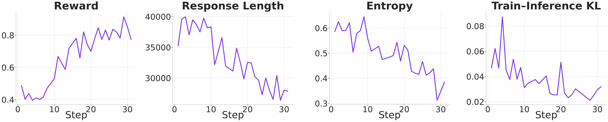

# ScienceIDE RL: agentic RL on scientific-computing repair tasks

Trains a model to fix injected defects in real scientific simulation codebases
(LAPS, MITgcm, Athena++). Each task is a containerized [Harbor](https://github.com/laude-institute/harbor)
episode: the agent gets a repository and an instruction, edits source, and a
verifier recompiles and compares numerical output against reference frames.

The reward is earned by making a simulation numerically correct again, not by
matching a diff. That makes it unusually hard to game and unusually slow to
grade: budget 8 to 15 minutes per episode for the image build alone.

Training runs on [PSRL](https://github.com/psrl-project/psrl), a modified veRL
that attaches a black-box agent harness with minimal glue. See
[Relationship to PSRL](#relationship-to-psrl).

## Results

Qwen3.5-4B on the `laps` repair bank at hint level L1, GRPO, 3 nodes:

<p align="center">
  
</p>

Reward climbs from 0.49 to 0.77, peaking at 0.91. Response length falls from
~40k tokens to ~28k over the same window, so the gain is not bought by rambling:
the policy is finding the defect in fewer tokens. Entropy decays smoothly
(0.59 to 0.38) rather than collapsing, and train-inference KL stays flat around
0.03, which is the check that the rollout and trainer policies have not drifted
apart. Reproduce the figure with
[`scienceide_rl/plot/plot.py`](scienceide_rl/plot/plot.py) against a run log.

## Install

### 1. PSRL, the training backend

PSRL is not on PyPI. Install it from source first, following its
[installation guide](https://psrl.readthedocs.io/en/latest/tutorial/installation.html):

```bash
# Rust is a build prerequisite.
curl --proto '=https' --tlsv1.2 -sSf https://sh.rustup.rs | sh
source "$HOME/.cargo/env"

conda create -n psrl python=3.12 && conda activate psrl

git clone https://github.com/psrl-project/psrl.git && cd psrl
bash scripts/install_basic.sh        # vLLM, veRL, core deps
bash scripts/install_nixl.sh         # RDMA weight sync, recommended
python -m pip install -e .
```

A Docker image is also available, which skips the build steps entirely. Check
the PSRL README for the current tag.

### 2. This package

```bash
cd ScienceIDE/RL
python -m pip install -e .
```

Installing rather than running in place matters: the agent loop is named by
module path in a Hydra config and imported inside Ray workers on every node, so
it has to resolve independently of the working directory.

Verify both halves are importable:

```bash
python -c "import psrl, scienceide_rl; print('ok')"
```

### 3. The task bank

Tasks live in their own repository, because they are large and authored on a
separate cadence:

```bash
export SCIACCEL_REPO=/path/to/sciaccel-rl
git clone https://github.com/HHHHHejia/sciaccel-rl.git -b easy-rl ${SCIACCEL_REPO}
```

Five environments ship there, and every one has the same shape, so nothing in
this recipe is env-specific:

| env | Codebase | Easy repair tasks |
|---|---|---|
| `laps` | LAPS (MHD, Fortran) | 32 |
| `mitgcm-biogeo` | MITgcm biogeochemistry | 87 |
| `mitgcm-atmos` | MITgcm atmosphere | 123 |
| `athena-gr` | Athena++ general relativity | 104 |
| `athena-fft` | Pinned Athena++ source archive only, reused by `athena-gr` | n/a |

Authored tasks are **sparse** and must be compiled before Harbor can build them.
That, the L1/L2/L3 hint levels, the dataset layout, and node warming are all in
[`scienceide_rl/prepare/README.md`](scienceide_rl/prepare/README.md).

## Quickstart

```bash
# Compile tasks, resolve hint lines, build datasets, warm image caches.
bash scienceide_rl/prepare/prepare_all.sh \
    --repo ${SCIACCEL_REPO} --envs mitgcm-biogeo \
    --hosts 192.168.1.1,192.168.1.2

# Prove the harness works before spending GPUs. oracle must score ~1.0.
bash scienceide_rl/eval/run_eval.sh --agent oracle \
    --dataset scienceide_rl/data/mitgcm-biogeo/repair_easy/all/L1.parquet \
    --output-dir scienceide_rl/outputs/anchor --skip-gpu-tasks -n 1

# Train.
bash scripts/fsdp_qwen35_4b.sh
```

The oracle step is not optional. A model number measured against a broken
verifier is worse than no number.

## Relationship to PSRL

[PSRL](https://github.com/psrl-project/psrl) is the RL backend. It is a modified
[veRL](https://github.com/volcengine/verl) that decouples rollout, reward, and
training behind a Parameter Server, so generation and training run
asynchronously with bounded model-version staleness.

What this recipe uses it for:

| PSRL provides | Used here as |
|---|---|
| Black-box agent harness integration (SessionRouter, TITO) | Harbor's `terminus-2` drives an episode while PSRL collects the trajectory |
| Agent-loop extension point | [`agent_loop.py`](scienceide_rl/agent_loop.py) registers through a Hydra `_target_` |
| Pluggable reward function | [`reward.py`](scienceide_rl/reward.py) reads the verifier's score |
| Async GRPO with staleness control | `scripts/fsdp_qwen35_4b.sh` |
| vLLM fleet serving | `scienceide_rl/eval/run_eval.sh` calls `psrl.eval.serve` |

Attaching a containerized harness needed no change inside PSRL: this package
implements one agent loop plus one reward function and is registered by config.

## Where things are

| Path | Purpose |
|------|---------|
| [`scienceide_rl/prepare/`](scienceide_rl/prepare/) | **Data preparation.** Compile tasks, build hinted datasets, warm caches |
| [`scienceide_rl/eval/`](scienceide_rl/eval/) | **Standalone eval**, independent of the training stack |
| [`scripts/fsdp_qwen35_4b.sh`](scripts/fsdp_qwen35_4b.sh) | GRPO training entry point |
| [`scripts/eval_qwen35_4b.sh`](scripts/eval_qwen35_4b.sh) | Score a checkpoint through PSRL, no training |
| [`scienceide_rl/agent_loop.py`](scienceide_rl/agent_loop.py) | PSRL agent loop, one Harbor episode per prompt |
| [`scienceide_rl/runner.py`](scienceide_rl/runner.py) | Black-box Harbor job runner |
| [`scienceide_rl/agent.py`](scienceide_rl/agent.py) | terminus-2 subclass with observation truncation |
| [`scienceide_rl/reward.py`](scienceide_rl/reward.py) | Verifier reward extraction |
| [`scienceide_rl/exceptions.py`](scienceide_rl/exceptions.py) | Harness failure to `TerminateReason` mapping |
| [`scienceide_rl/config.py`](scienceide_rl/config.py) | Runtime config dataclasses |
| [`scienceide_rl/config/`](scienceide_rl/config/) | Agent loop registration, chat template, compose overlays |
| [`scienceide_rl/plot/plot.py`](scienceide_rl/plot/plot.py) | Training curves from a run log |

## Conventions

| Placeholder | Meaning |
|---|---|
| `${PSRL_WORKSPACE}` | Your workspace root, holding `env/`, `models/`, `hosts/` |
| `${SCIACCEL_REPO}` | Your checkout of the task bank |
| `192.168.1.x` | Stand-in node addresses. Substitute your own |

Paths inside this repository are written relative to the repository root, so run
every command from there.

---

## Train

```bash
bash scripts/fsdp_qwen35_4b.sh
```

Defaults to `mitgcm-biogeo/repair_easy` at `L1` on 3 nodes (8 generation + 16
training GPUs). Hydra overrides pass straight through, and any of these can be set
in the environment:

```bash
HF_MODEL_PATH=${PSRL_WORKSPACE}/models/Qwen3.5-4B \
DATA_DIR=scienceide_rl/data/athena-gr/repair_easy \
HINT_LEVEL=L1 \
AGENT_NODE_IPS=192.168.1.1,192.168.1.2 \
    bash scripts/fsdp_qwen35_4b.sh
```

| Variable | Default | Meaning |
|---|---|---|
| `HF_MODEL_PATH` | `${PSRL_WORKSPACE}/models/Qwen3.5-4B` | Model to train |
| `DATA_DIR` | `data/mitgcm-biogeo/repair_easy` | Dataset directory. Becomes part of the experiment name. |
| `HINT_LEVEL` | `L1` | `L1`, `L2`, or `L3`. Selects `train/${HINT_LEVEL}.parquet`. |
| `VAL_FILES` | `eval/${HINT_LEVEL}.parquet` | Point at `eval/unhinted.parquet` to score unaided localization. |
| `AGENT_NODE_IPS` | empty | Nodes allowed to host containers. Empty means all alive nodes. |
| `OVERLONG_FILTERING` | `True` | DAPO overlong filtering. See below. |
| `GROUP_FILTER` | `False` | Drop zero-variance GRPO groups. |
| `MAX_TURNS` | `50` | Turn cap. Raising it needs `MAX_RESPONSE_LENGTH` raised too. |
| `OUTPUT_DIR` | `scienceide_rl` | Root for `ckpts/` and `psrl_logs/`. |

### Metrics that matter

Watch these rather than `critic/score/mean` alone, which blends populations that
move in opposite directions:

- `termination/finished/score_mean`: reward on episodes that actually finished
- `termination/verifier_error/fraction`: share whose verifier never produced a
  score. These are masked out of the gradient, but a rising number means the
  cluster is eating rollouts
- `termination/max_turns_exceeded/fraction`: share cut off by the turn cap
- `group/zero_variance_fraction`: share of GRPO groups producing no gradient
- `rollout_corr/rollout_is_eff_sample_size`: rollout-vs-trainer agreement. A drop
  here means a weight-transfer problem, not an RL one

`OVERLONG_FILTERING=True` zeroes the loss mask of episodes whose reward reports
the harness rather than the policy, while keeping that reward in the GRPO
baseline. Two cases qualify:

- **Budget-truncated**, cut off mid-work by the turn or length cap. Grading that
  as a policy failure makes `token-mean` reward shorter turns, which spends the
  turn cap faster still. Leaving this off has collapsed a run.
- **Ungraded**, where the verifier never ran. Its 0.0 is a missing measurement
  rather than a measured failure, so training it is pure infrastructure noise.

---

## Evaluate

### Through PSRL, reusing the training topology

```bash
EVAL_BASE=False \
CKPT_PATH=scienceide_rl/ckpts/sciaccel_rl_mit/<experiment>/global_step_30 \
    bash scripts/eval_qwen35_4b.sh
```

`val_only=True` returns straight after the initial validation, so nothing trains
and no optimizer step runs. `resume_mode=resume_path` loads the named checkpoint
rather than searching, which matters: `auto` would find nothing in the empty eval
directory and silently score the **base** model. `EVAL_BASE=True`, the default,
scores the untrained weights and is the baseline every checkpoint is measured
against.

The checkpoint is FSDP-sharded across 16 ranks, so it must be scored on the same
`TRAIN_NNODES x TRAIN_NGPUS_PER_NODE` topology that wrote it.

### Standalone, without PSRL

Use [`eval/`](scienceide_rl/eval/) when you want a number without the training stack: it serves
the model with vLLM, drives Harbor's own `terminus-2` harness, and aggregates by
category and family.

```bash
bash scienceide_rl/eval/run_eval.sh \
    --model ${PSRL_WORKSPACE}/models/Qwen3.5-4B \
    --dataset scienceide_rl/data/mitgcm-biogeo/repair_easy/eval/L1.parquet \
    --output-dir scienceide_rl/outputs/eval_biogeo_base \
    --skip-gpu-tasks
```

Two agents need no model at all and are the fastest way to test infrastructure:

| `--agent` | Does | Use for |
|---|---|---|
| `nop` | Builds the environment, edits nothing | Warming the image cache, and proving a node can build |
| `oracle` | Applies the known fix from `solution/` | Proving the verifier grades a correct patch |

`oracle` is the real end-to-end check, and it should score near 1.0. Anything
lower means the task or verifier is broken rather than the model. Budget time for
it: a single MITgcm task takes about 8 minutes to build and up to 15 more in the
verifier (`verifier_timeout_sec: 900`).

See [`eval/README.md`](scienceide_rl/eval/README.md) for filters, serving topology, and output
layout, and [`eval/FINDINGS.md`](scienceide_rl/eval/FINDINGS.md) for a measured Qwen3.5-9B
baseline.

---

## Gotchas worth knowing before you hit them

- **The verifier's 120 s reference-run cap is the top source of wasted episodes.**
  Under concurrency a 3 s simulation can overrun it, and the episode then carries
  no verifier score at all. Lower `harbor.max_concurrent_episodes` or raise
  `ROW_TIMEOUT_MAX` in the env's `factory/config.py`, which requires a recompile.
  Watch `termination/verifier_error/fraction`.
- **`/tmp` is node-local.** Put datasets on the shared filesystem before a
  cross-node run, or the remote node reads a stale copy and fails against paths
  that no longer exist.
- **Editing the `prompt` column does nothing.** Harbor re-reads `instruction.md`
  from disk. The hint reaches the model through `extra_info["hint"]`, which
  `runner.py` passes as Harbor `extra_instructions`. The `prompt` column is a
  record of the delivered text, not the delivery path.
- **`task_path` is absolute, baked at dataset-build time.** Moving or recompiling
  the task bank invalidates an existing parquet. Rebuild it.
- **`max_model_len` is the agent's budget, not slack.** It is forwarded to
  terminus-2 as `max_input_tokens`, so any headroom is headroom the agent will
  spend, and TITO then hands the trainer a response longer than
  `max_response_length`.
- **Dangling images accumulate over days** on fuse-overlayfs and eventually wedge
  the daemon. Prefer batched `docker rmi -f`, because `docker image prune -f`
  crawls once the daemon is already degraded.
